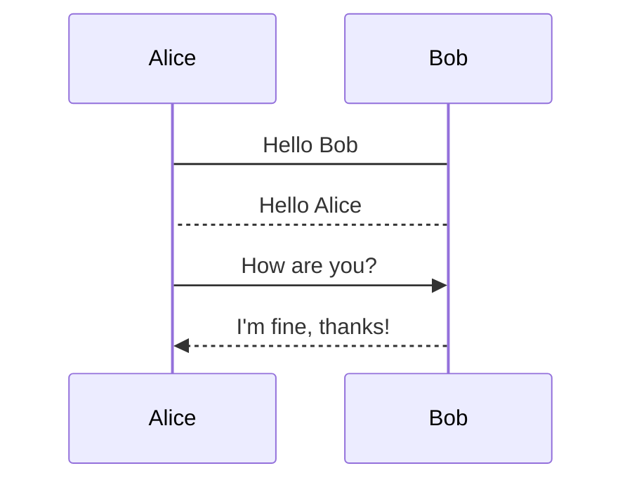

# mermaid2drawio

MermaidのシーケンスダイアグラムをDraw.io形式に変換するコマンドラインツールです。

## 概要

このツールは、Mermaidで書かれたシーケンス図をDraw.io（diagrams.net）で編集可能なXML形式に変換します。変換後の図は：

- マウスで要素を移動可能
- 線や矢印を自由に編集可能
- Draw.ioで直接開いて編集可能

## プロジェクト構造

```
├── cmd/
│   └── cli-tool/           # メインアプリケーション
│       ├── main.go
│       └── main_test.go
├── internal/
│   ├── mermaid/           # Mermaidパーサー
│   │   ├── parser.go
│   │   └── parser_test.go
│   ├── drawio/            # Draw.io XML生成
│   │   ├── generator.go
│   │   └── generator_test.go
│   └── commands/          # 旧コマンドロジック
│       ├── commands.go
│       └── commands_test.go
├── bin/                   # ビルド出力
├── test_input.mmd        # テスト用入力ファイル
├── coverage.out          # テストカバレッジ
├── coverage.html         # カバレッジレポート
├── .gitignore
├── go.mod
└── README.md
```

## インストール

```bash
go build -o bin/mermaid2drawio ./cmd/cli-tool
```

## 使用方法

### 基本的な使用方法

```bash
cat sequence.mmd | ./bin/mermaid2drawio > output.drawio
```

### 詳細エラー出力

```bash
cat sequence.mmd | ./bin/mermaid2drawio -verbose > output.drawio
```

## サポートする機能

### Mermaid要素

- **participant** - 参加者の定義
- **メッセージタイプ**:
  - `->` : 実線矢印
  - `-->` : 破線矢印  
  - `->>` : 実線矢印（塗りつぶし）
  - `-->>` : 破線矢印（塗りつぶし）

### 入力例



### 出力

Draw.io XMLファイルが生成され、以下が含まれます：

- 参加者ボックス（移動可能）
- ライフライン（縦線）
- メッセージ矢印（編集可能）

## 開発

### テスト実行

```bash
# 全テスト実行
go test ./...

# カバレッジ付きテスト
go test -v -coverprofile=coverage.out ./...

# カバレッジレポート生成
go tool cover -html=coverage.out -o coverage.html
```

### テストカバレッジ

- **総合カバレッジ**: 75.0%
- **Mermaidパーサー**: 89.1%
- **Draw.io生成器**: 92.7%
- **コマンド**: 100%

### ビルド

```bash
go build -o bin/mermaid2drawio ./cmd/cli-tool
```

### 動作確認

```bash
# テストファイルで確認
cat test_input.mmd | ./bin/mermaid2drawio > test_output.drawio

# Draw.ioで test_output.drawio を開いて確認
```

## エラーハンドリング

- **デフォルト**: エラー時は終了コードのみ返す
- **詳細モード**: `-verbose`オプションでエラー詳細を標準エラー出力

## 今後の拡張予定

- Note要素のサポート
- Activate/Deactivateのサポート
- より複雑なMermaid構文への対応
- ライフラインの位置調整機能